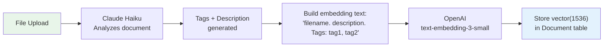
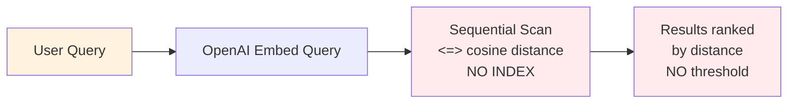
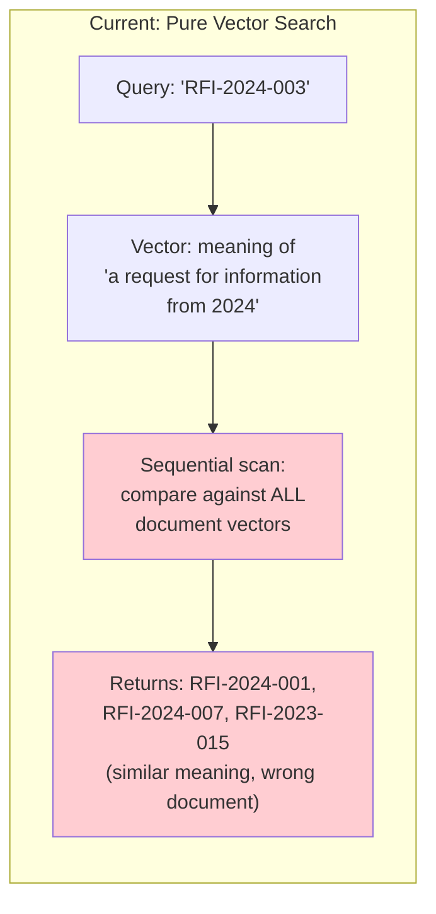
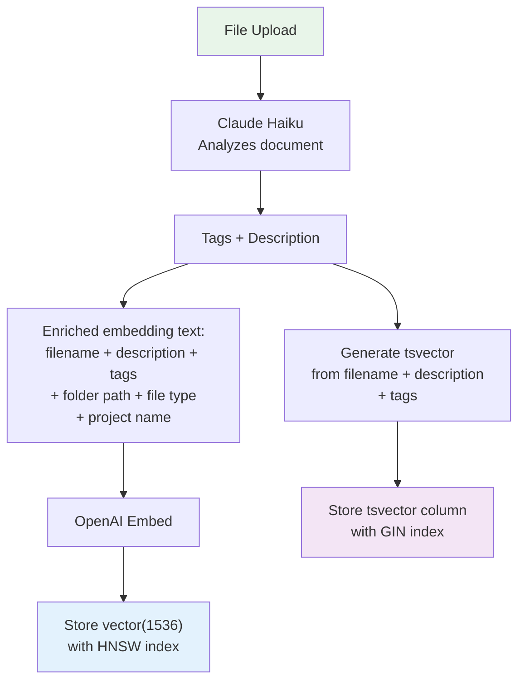
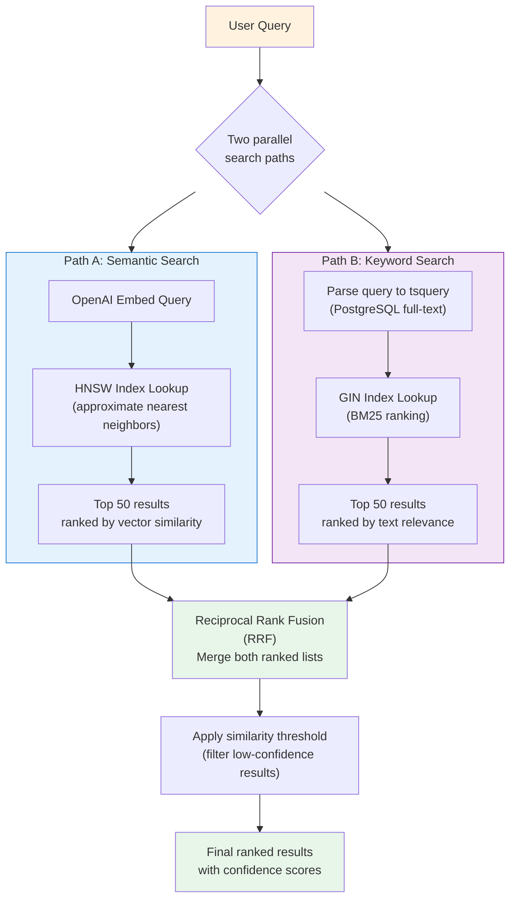
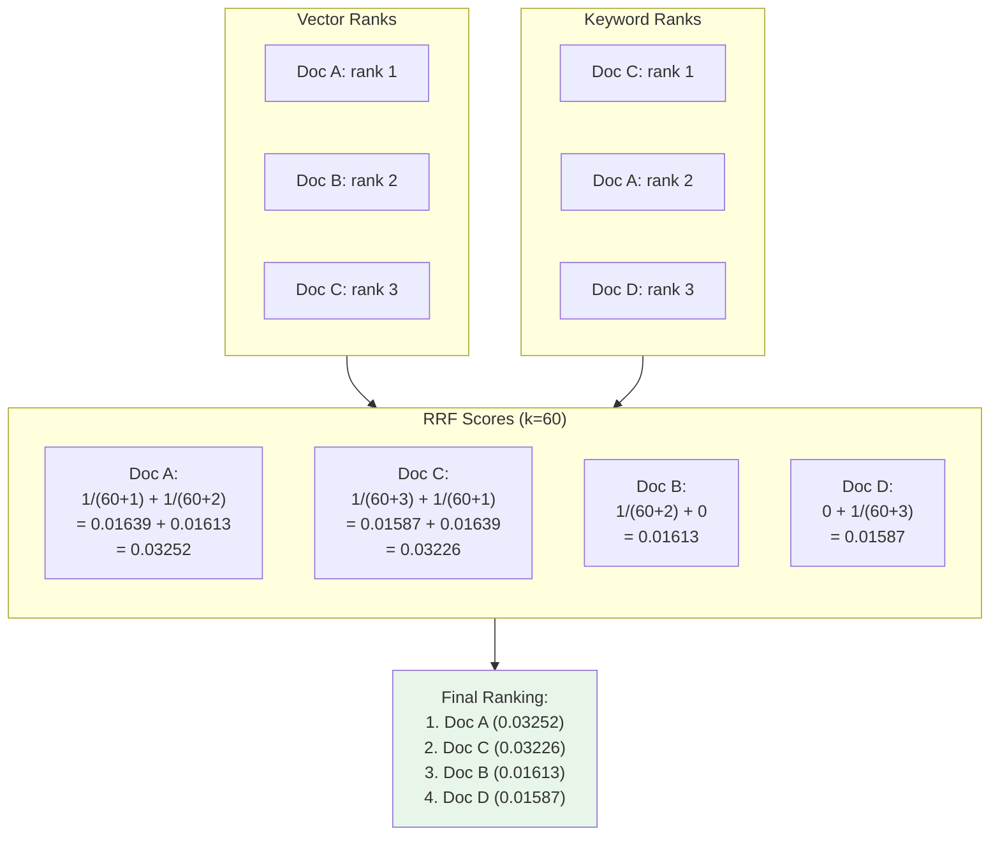
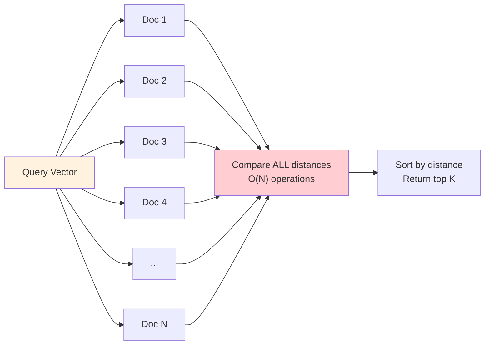
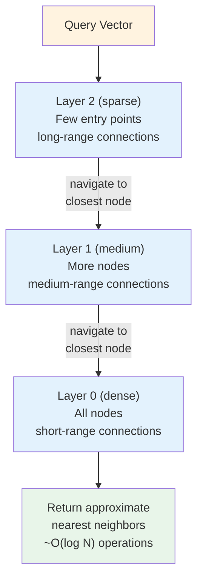
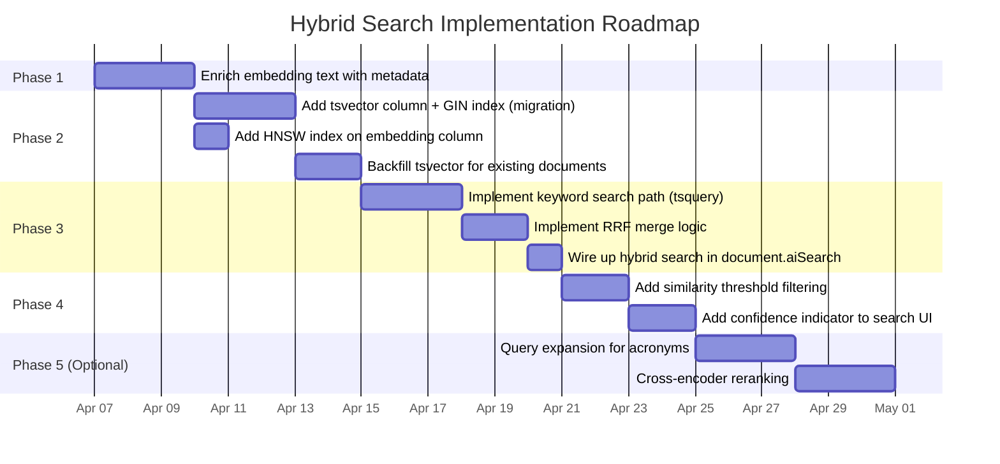
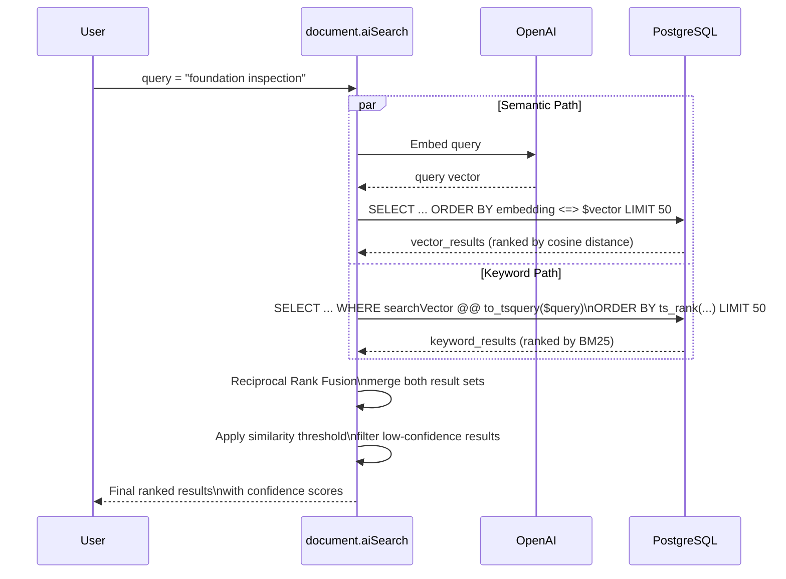

# AI Search Improvements: From Pure Vector to Hybrid Search

Technical design document for upgrading the document explorer's AI search from pure vector similarity to a hybrid search system combining semantic understanding with keyword precision.

**Decision: Upstash Vector** was chosen as the search infrastructure. It provides built-in hybrid search (vector + BM25 + RRF) via a single API call, native Vercel marketplace integration, and replaces ~150 lines of DIY PostgreSQL SQL with ~40 lines of SDK code at $0-5/mo. See the plan file for full implementation details.

---

## 1. Current Architecture (Before)

The current system follows a single-path pipeline: documents are embedded on upload, and searches run a sequential cosine distance scan across every vector in the table.

### Upload Flow



### Search Flow



### The Problem

The current system has two fundamental weaknesses:

**Problem 1 -- Exact keyword searches fail.** Vector embeddings capture semantic meaning, not exact tokens. When a user searches for `RFI-2024-003`, the embedding model converts that into a meaning-vector representing "a request for information document from 2024." It returns semantically similar RFI documents instead of the exact one. The same issue applies to document numbers, purchase order IDs, submittal references, and any identifier-style query.

**Problem 2 -- No index means sequential scan.** Every search compares the query vector against every single document vector in the table using cosine distance. At 100 documents this is imperceptible. At 5,000+ documents, the scan becomes the query bottleneck.



---

## 2. Proposed Architecture (After) -- Hybrid Search

The improved system runs two parallel search paths and merges their results using Reciprocal Rank Fusion (RRF).

### Upload Flow (Enhanced)



Key changes on upload:
- Embedding text is enriched with folder path, file type, and project metadata
- A new `searchVector` column (`tsvector`) is generated from the document's text content
- Both columns are indexed (HNSW for vectors, GIN for tsvector)

### Search Flow (Hybrid)



---

## 3. Why Hybrid Search Works -- Side-by-Side Comparison

Different query types exercise different search capabilities. Pure vector search and pure keyword search each have blind spots. Hybrid search covers both.

| Query | Pure Vector (Current) | Keyword Only | Hybrid (Proposed) |
|-------|----------------------|--------------|-------------------|
| `RFI-2024-003` | Returns similar RFIs, not the exact one. Vector captures "RFI concept" not the literal string. | Exact match on the token `RFI-2024-003` in the document name or description. | Keyword leg finds the exact document. Vector leg may contribute related context. |
| `foundation inspection photos` | Good semantic match. Finds documents about "concrete footing assessment" even without those exact words. | Misses documents titled "Concrete Footing Assessment Report" because no keyword overlap. | Both legs contribute. Semantic matches and keyword matches are merged. |
| `show me the electrical stuff` | Reasonable. Captures the concept of "electrical" even with vague phrasing. | Fails. No exact match for "stuff" or the casual phrasing. | Vector leg carries the result. Keyword leg contributes nothing but does not hurt. |
| `submittal for drywall` | Decent. Finds documents semantically related to drywall submittals. | Finds documents with "drywall" or "submittal" in the name. | Best of both. Documents matching both semantically and by keyword rank highest. |
| `CO #47` | Poor. Embeddings treat this as a generic "change order" concept. | Exact match on the token `CO #47`. | Keyword leg finds the exact change order. |
| `photos from last week's pour` | Good semantic match for "concrete pouring photos." | Fails on "last week's pour" -- no keyword match. | Vector leg finds the right documents by meaning. |

The pattern: **keyword search wins on identifiers and exact references; vector search wins on natural language and conceptual queries.** Hybrid search does not need to choose -- it gets the best result from whichever leg is stronger for that particular query.

---

## 4. Reciprocal Rank Fusion (RRF) Explained

RRF is a simple, parameter-light algorithm for merging two (or more) ranked lists. It does not require the scores from each list to be on the same scale -- it only uses rank positions.

### The Formula

```
RRF_score(doc) = SUM over each ranked list:  1 / (k + rank_in_list)
```

Where `k` is a constant (typically 60) that prevents top-ranked results from dominating too aggressively.

### Worked Example

Suppose a user searches for `"drywall submittal"`. The two search paths return:

**Vector results** (semantic similarity):

| Rank | Document |
|------|----------|
| 1 | Doc A -- "Drywall Material Submittal Package" |
| 2 | Doc B -- "Interior Wall Finish Specifications" |
| 3 | Doc C -- "Gypsum Board Installation Photos" |

**Keyword results** (full-text search):

| Rank | Document |
|------|----------|
| 1 | Doc C -- "Gypsum Board Installation Photos" (contains "drywall" tag) |
| 2 | Doc A -- "Drywall Material Submittal Package" (exact keyword match) |
| 3 | Doc D -- "Submittal Log - Week 12" (contains "submittal") |

### RRF Calculation (k = 60)



**Result:** Doc A ranks first because it scored well in both lists. Doc C is close behind. Doc B (only in vector results) and Doc D (only in keyword results) still appear but rank lower because they only contributed from one leg.

### Why RRF Works Well

- **No score calibration needed.** Vector cosine distances and BM25 text scores are on completely different scales. RRF ignores scores entirely and only uses rank positions.
- **Robust to noise.** A document that ranks highly in both lists almost always deserves to be in the final results. A document that only appears in one list gets a reasonable but lower score.
- **Single parameter.** The constant `k=60` is standard and rarely needs tuning. Higher `k` values flatten the curve (ranks matter less); lower values sharpen it (top ranks dominate more).

---

## 5. HNSW Index Visualization

HNSW (Hierarchical Navigable Small World) is a graph-based approximate nearest neighbor index. Instead of comparing the query against every vector, it navigates a multi-layer graph to find neighbors quickly.

### Without Index (Current)



**Cost:** O(N) distance computations. Every search touches every row.

### With HNSW Index (Proposed)



**Cost:** O(log N) distance computations on average. The graph structure means most vectors are never examined.

### Performance at Scale

| Document Count | Sequential Scan | HNSW Index | Speedup |
|---------------|----------------|------------|---------|
| 100 | ~1ms | ~1ms | 1x (negligible) |
| 1,000 | ~5ms | ~2ms | 2.5x |
| 10,000 | ~50ms | ~5ms | 10x |
| 100,000 | ~500ms | ~10ms | 50x |

**Trade-off:** HNSW returns approximate results (not guaranteed exact nearest neighbors). At the recall levels pgvector uses by default (~99%), the quality difference is undetectable in practice. The index uses additional disk space (roughly 2x the vector data size).

### Migration SQL

```sql
-- Create the HNSW index on the existing embedding column
CREATE INDEX CONCURRENTLY idx_document_embedding_hnsw
  ON "Document"
  USING hnsw (embedding vector_cosine_ops)
  WITH (m = 16, ef_construction = 64);
```

`CONCURRENTLY` allows the index to build without locking the table. At 1,000 documents this takes seconds; at 100,000 it may take a few minutes.

---

## 6. Implementation Phases



### Phase Details

**Phase 1: Enrich Embedding Text** (Low effort, medium impact)

Change the text sent to OpenAI embeddings to include folder path, file type, and project context. No migration needed -- just update the upload route. Re-embed existing documents with a backfill script.

**Phase 2: Add Indexes and tsvector Column** (Migration required)

Add a `searchVector tsvector` column to the `Document` table with a GIN index. Add an HNSW index on the existing `embedding` column. Backfill the tsvector for all existing documents.

**Phase 3: Implement Hybrid Search** (Core feature)

Build the two-path search in `document.aiSearch`: embed the query for vector search, parse it to `tsquery` for keyword search, run both in parallel with `Promise.all`, merge with RRF.

**Phase 4: Threshold and Confidence UI** (Quality improvement)

Filter results below a minimum RRF score. Show a confidence indicator in the UI (high/medium/low match quality) based on whether a result appeared in both legs, one leg, or barely above threshold.

**Phase 5: Optional Enhancements** (Future)

Query expansion to handle construction acronyms (`CO` maps to `change order`, `RFI` maps to `request for information`). Cross-encoder reranking uses a more expensive model to re-score the top N results for higher precision.

---

## 7. Embedding Text Enrichment

The embedding text is the single most important input to semantic search quality. Richer text means the vector captures more about the document.

### Before (Current)

```
Foundation Report. Detailed structural assessment of concrete footings.
Tags: foundation, concrete, structural, inspection
```

The embedding captures the meaning of "a structural assessment of concrete foundations." It knows nothing about where the document lives in the project, what kind of file it is, or which project it belongs to.

### After (Proposed)

```
Foundation Report. Detailed structural assessment of concrete footings.
Tags: foundation, concrete, structural, inspection.
Folder: Inspections > Structural.
File type: PDF.
Project: Building A Phase 2.
Uploaded: 2026-03-15
```

Now the embedding also captures:
- **Folder context** -- a search for "inspection documents" matches even if the filename does not say "inspection"
- **File type** -- a search for "PDF reports" distinguishes from photos
- **Project context** -- narrows semantic similarity to the right project context
- **Temporal signal** -- "recent uploads" has a weak but useful signal

### Implementation

The change is localized to the upload route (`src/app/api/upload/route.ts`):

```ts
// Before
const textToEmbed = [cleanName, analysis.description, `Tags: ${analysis.tags.join(', ')}`].join('. ');

// After
const parts = [
  cleanName,
  analysis.description,
  `Tags: ${analysis.tags.join(', ')}`,
];
if (folder) parts.push(`Folder: ${folder.name}`);
parts.push(`File type: ${file.type.split('/')[1]?.toUpperCase() ?? 'UNKNOWN'}`);
if (project) parts.push(`Project: ${project.name}`);

const textToEmbed = parts.join('. ');
```

---

## 8. Database Schema Changes

### New Column and Indexes

```sql
-- Phase 2 migration

-- 1. Add tsvector column for full-text search
ALTER TABLE "Document"
  ADD COLUMN "searchVector" tsvector;

-- 2. GIN index for fast full-text search
CREATE INDEX idx_document_search_vector
  ON "Document"
  USING gin ("searchVector");

-- 3. HNSW index for fast vector similarity
CREATE INDEX CONCURRENTLY idx_document_embedding_hnsw
  ON "Document"
  USING hnsw (embedding vector_cosine_ops)
  WITH (m = 16, ef_construction = 64);

-- 4. Backfill tsvector for existing documents
UPDATE "Document"
SET "searchVector" = to_tsvector('english',
  coalesce("name", '') || ' ' ||
  coalesce("description", '') || ' ' ||
  coalesce("aiDescription", '') || ' ' ||
  coalesce(array_to_string("tags", ' '), '')
)
WHERE "searchVector" IS NULL;
```

### Prisma Schema Addition

```prisma
model Document {
  // ... existing fields
  searchVector  Unsupported("tsvector")?
}
```

Like the embedding column, `searchVector` uses `Unsupported()` in Prisma and is managed through raw SQL.

---

## 9. Hybrid Search Query Structure

The core of the hybrid search runs two queries in parallel and merges with RRF.

### Sequence Diagram



### RRF Merge (TypeScript Pseudocode)

```ts
function reciprocalRankFusion(
  vectorResults: { id: string }[],
  keywordResults: { id: string }[],
  k = 60
): Map<string, number> {
  const scores = new Map<string, number>();

  vectorResults.forEach((doc, index) => {
    const rank = index + 1;
    scores.set(doc.id, (scores.get(doc.id) ?? 0) + 1 / (k + rank));
  });

  keywordResults.forEach((doc, index) => {
    const rank = index + 1;
    scores.set(doc.id, (scores.get(doc.id) ?? 0) + 1 / (k + rank));
  });

  return scores; // Sort descending by score for final ranking
}
```

---

## 10. Key Files to Modify

| File | Change |
|------|--------|
| `src/app/api/upload/route.ts` | Enrich embedding text (Phase 1). Generate and store tsvector on upload (Phase 2). |
| `src/server/services/embeddings.ts` | No changes needed -- existing functions work as-is. |
| `src/server/api/routers/document.ts` | Replace `aiSearch` with hybrid search: parallel vector + keyword queries, RRF merge, threshold filter (Phase 3-4). |
| `prisma/schema.prisma` | Add `searchVector Unsupported("tsvector")?` to Document model (Phase 2). |
| `prisma/migrations/` | New migration for tsvector column, GIN index, HNSW index (Phase 2). |
| `src/components/documents/` | Add confidence indicator to search results UI (Phase 4). |

---

## 11. Database Architecture Decision

The search infrastructure stays in PostgreSQL (Neon). Here is the evaluation of alternatives and the metadata storage strategy.

### Search Infrastructure Options Evaluated

| Option | What it means | Verdict |
|--------|--------------|---------|
| **PostgreSQL + pgvector + tsvector (current DB)** | Vector search, full-text search, and structured metadata all in one database. Zero new infrastructure. | **Chosen.** Sufficient for <500K documents. Single source of truth. No sync issues. |
| **Add Elasticsearch / Typesense** | Separate search engine synced from PostgreSQL. Best-in-class full-text search, facets, typo tolerance. | **Not now.** Adds infrastructure cost ($50-150/mo), data sync complexity, and ops overhead. Revisit at 100K+ documents or if faceted navigation becomes a requirement. |
| **Dedicated Vector DB (Pinecone, Weaviate, Qdrant)** | Move embeddings to a purpose-built vector database. | **Not now.** pgvector handles our scale. Extra network hop adds latency. Adds another service to manage. Revisit at 500K+ vectors. |

### Why PostgreSQL Wins for Now

1. **Scale** -- Even at 1,000 projects x 500 docs = 500K documents, PostgreSQL + pgvector + tsvector handles this with proper indexing (HNSW + GIN)
2. **Neon** -- Preview branch databases, autoscaling, and zero server management come free with the existing Vercel-Neon integration
3. **Single transaction writes** -- Upload creates the document record, embedding, tsvector, and structured metadata in one database. No sync drift between systems.
4. **Cost** -- No additional service costs. Search queries hit the same database connection pool already provisioned.

### Structured Metadata Storage Strategy

For the metadata extracted by Claude Haiku during AI analysis (trade, document type, location references, materials):

| Approach | Use for | Index strategy |
|----------|---------|---------------|
| **Dedicated columns** (`trade`, `documentType`) | The 3-4 fields you always filter on. Fast `WHERE` clauses, clean Prisma types. | B-tree index on each |
| **JSONB column** (`metadata jsonb`) | Variable fields that differ by document type (location references, materials, people mentioned). Filter with `metadata->>'field'`. | GIN index on the JSONB column |

**Recommended: use both.** Dedicated columns for hot filters + JSONB for everything else. This avoids constant schema migrations as new metadata fields emerge while keeping the most-used filters fast.

```prisma
model Document {
  // ... existing fields
  trade         String?                        // "electrical", "plumbing", "concrete", etc.
  documentType  String?                        // "submittal", "rfi", "inspection", "photo", etc.
  metadata      Json?                          // { locationReferences: [...], materials: [...], ... }
  searchVector  Unsupported("tsvector")?
}
```

---

## 12. Decision Log

| Decision | Rationale | Alternative Considered |
|----------|-----------|----------------------|
| RRF over weighted sum | RRF requires no score calibration between vector and keyword results. A weighted sum would need tuning and the scales are incomparable. | Weighted linear combination of normalized scores. |
| k=60 for RRF constant | Industry standard from the original RRF paper (Cormack, Clarke, Butt 2009). Works well across domains without tuning. | k=20 (more aggressive top-rank emphasis). |
| HNSW over IVFFlat | HNSW has better recall at the same speed for our document counts (under 100K). IVFFlat requires periodic re-training as data grows. | pgvector IVFFlat index. |
| tsvector over Elasticsearch | Keeps everything in PostgreSQL. No additional infrastructure. Full-text search quality is sufficient for document names and descriptions. | External Elasticsearch/Typesense cluster. |
| Parallel paths over sequential | Running vector and keyword searches concurrently in `Promise.all` keeps latency equal to the slower of the two (typically vector), not the sum. | Run keyword first, then vector only if keyword results are insufficient. |
| Enriched embedding text over separate metadata vectors | Simpler architecture. One vector per document. Metadata context improves the primary vector quality without requiring a separate retrieval step. | Store metadata as separate vectors and combine scores. |
